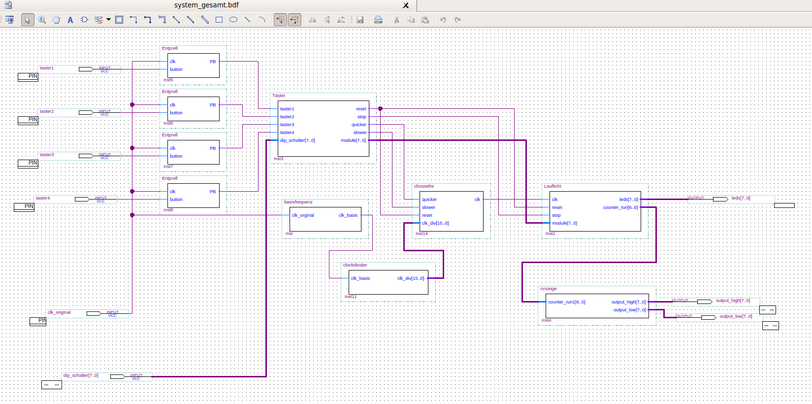
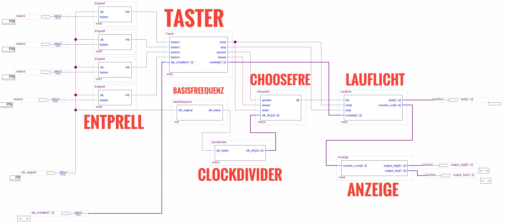

# VHDL

This is the practice course @KIT Praktikum Schaltungsdesign mit FPGA
https://www.ims.kit.edu/324_143.php

Ziele:
Im Praktikum "Systeme mit programmierbarer Logik“ soll der praktische Umgang mit ASICs, ihrer Programmierung und dem abschließenden Funktionstest der entworfenen Logikfunktionen auf Hardware-Niveau vermittelt werden. 
Inhalt:
Einführung in die integrierte Entwicklungsumgebung Quartus II anhand der Erstellung von Faltungscodierern
Erstellung von Simulationsstimuli und Vergleich der Simulationsergebnisse der erstellten Codierer.
Programmieren des Logikbausteins unter Berücksichtigung der speziellen Hardware  
Erstellung von digitalen Filtern mittels fortgeschrittenen graphischen Entwurfs (Verwendung der integrierten Werkzeuge der Entwicklungsumgebung).
Programmierung und Messung der erstellten Filter.
Erstellung von parametrisierten digitalen Filtern in VHDL unter Berücksichtigung verschiedener Varianten der Implementierung.
Vergleich und Diskussion des Bedarfs an Logikzellen und der Leistungsfähigkeit der Filter.

Circuit Design with VHDL
3 Projects: Convolutional Encoder/Digital Filter/Running Light

## Overview System Designs of Convolutional Encoder

## Overview System Designs of Running Light

## Overview System Designs of Digital Filter

